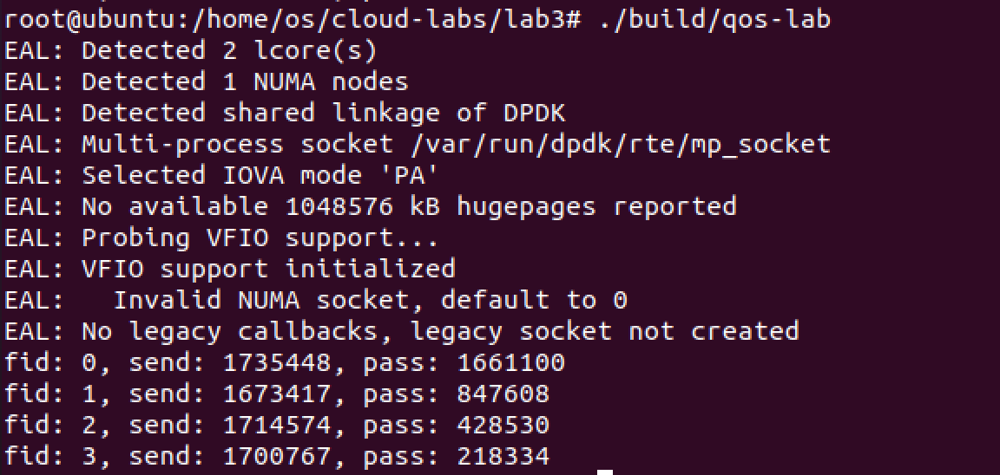

# lab 3

## 518021910515 许嘉琦

## parameter deduction

### meter

| `flow_id` | `cir`     | `cbs` | `ebs`  |
| --------- |:--------- | ----- | ------ |
| 0         | 160000000 | 80000 | 160000 |
| 1         | 80000000  | 40000 | 80000  |
| 2         | 40000000  | 20000 | 40000  |
| 4         | 20000000  | 10000 | 20000  |

+ 1.28Gbps = 160Mbyte/s = 160,000,000, 故flow0的cir为160000000,其他flow的cir按8:4:2:1计算
+ 之后cbs和ebs的比例按照8:4:2:1固定，ebs设为cbs的两倍，从一定值开始增大，最后得出如表所示结果

### dropper

| `color` | `min_th` | `max_th` | `maxp_inv` | `wq_log2`           |
| ------- | -------- | -------- | ---------- | ------------------- |
| GREEN   | 1022     | 1023     | 10         | RTE_RED_WQ_LOG2_MIN |
| YELLOW  | 1022     | 1023     | 10         | RTE_RED_WQ_LOG2_MIN |
| RED     | 0        | 1        | 10         | RTE_RED_WQ_LOG2_MIN |

+ 红色的包全丢弃
+ 黄，绿包的队列足够长
+ wq_log2值影响计算出avg随真实avg的变化的快慢，对于本实验没有很大影响
+ maxp_inv全采用dpdk example中的10

### Test Result

1661100:847608:428530:218334 = 7.7:3.8:1.9:1.0

## DPDK API introduction

+ `rte_get_tsc_hz`:Get the measured frequency of the RDTSC counter
+ `rte_get_tsc_cycles`:Return the number of TSC cycles since boot
- `rte_panic`: Provide notification of a critical non-recoverable error and terminate execution abnormally.Display the format string and its expanded arguments (printf-like).In a linux environment, this function dumps the stack and calls abort() resulting in a core dump if enabled.The function never returns.
- `rte_meter_srtcm_config`: srTCM configuration per metered traffic flow, Parameters:
  
  | name | description                                   |
  |:----:| --------------------------------------------- |
  | m    | Pointer to pre-allocated srTCM data structure |
  | p    | srTCM profile. Needs to be valid.             |
  
  Returns 0 upon success, error code otherwise
- `rte_red_config_init`: Configures a single RED configuration parameter structure.
  
  Parameters:
  
  | class    | name     | description                                                                                      |
  | -------- | -------- | ------------------------------------------------------------------------------------------------ |
  | [in,out] | config   | pointer to a RED configuration parameter structure                                               |
  | [in]     | wq_log2  | log2 of the filter weight, valid range is: RTE_RED_WQ_LOG2_MIN <= wq_log2 <= RTE_RED_WQ_LOG2_MAX |
  | [in]     | min_th   | queue minimum threshold in number of packets                                                     |
  | [in]     | max_th   | queue maximum threshold in number of packets                                                     |
  | [in]     | maxp_inv | inverse maximum mark probability                                                                 |
  
  Returns 0 upon success, !0 otherwise
- `rte_red_rt_data_init`: Initialises run-time data.
  
  Parameters:
  
  | class    | description                                        |
  | -------- | -------------------------------------------------- |
  | [in,out] | pointer to a RED configuration parameter structure |
  
  Returns 0 upon success, !0 otherwise
- `rte_meter_srtcm_color_blind_check`: srTCM color blind traffic metering.
  
  Parameters:
  
  | name    | descrption                                            |
  | ------- | ----------------------------------------------------- |
  | m       | Handle to srTCM instance                              |
  | p       | srTCM profile specified at srTCM object creation time |
  | time    | Current CPU time stamp (measured in CPU cycles)       |
  | pkt_len | Length of the current IP packet (measured in bytes)   |
  
  Returns Color assigned to the current IP packet
- `rte_red_mark_queue_empty`: Callback to records time that queue became empty.
- `rte_red_enqueue`: Decides if new packet should be enqeued or dropped Updates run time data based on new queue size value. Based on new queue average and RED configuration parameters gives verdict whether to enqueue or drop the packet.
  
  Parameters:
  
  | class    | name   | description                                        |
  | -------- | ------ | -------------------------------------------------- |
  | [in]     | config | pointer to a RED configuration parameter structure |
  | [in,out] | data   | pointer to RED runtime data                        |
  | [in]     | q      | updated queue size in packets                      |
  | [in]     | time   | current time stamp                                 |
  
  Return:
  
  | value | meaning                                            |
  | ----- | -------------------------------------------------- |
  | 0     | enqueue the packet                                 |
  | 1     | drop the packet based on max threshold criteria    |
  | 2     | drop the packet based on mark probability criteria |

